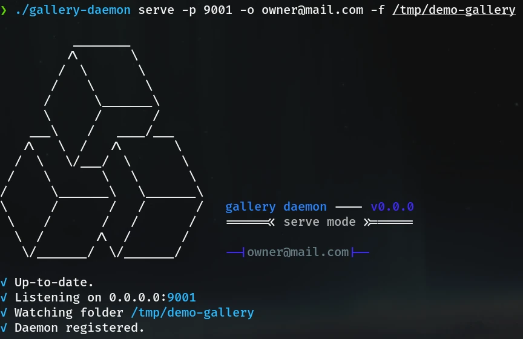

<!--suppress HtmlDeprecatedAttribute -->
<p align="center">
    <br />
</p>
<p align="center">
    A simple decentralized photo gallery
</p>
<p align="center">
    
    
    
</p>

# gallery-daemon
The daemon for the gallery app

## Usage
### Indexation only
```
$ ./gallery-daemon index --help
Starts the daemon in index mode only.

Indexes the given folder and create a database file.

Usage:
  gallery-daemon index [flags]

Flags:
  -h, --help   help for index

Global Flags:
  -f, --folder string   The folder containing the photos (default ".")
      --local-db        Place the database in the current folder
      --verbose         Verbose display
```

### Serve
```
$ ./gallery-daemon serve --help
Starts the daemon in server mode.

In this mode it will :
 - index the images if the database is not up-to-date
 - register the daemon to the backend
 - watch for file changes
 - serve backend requests

Usage:
  gallery-daemon serve [flags]

Flags:
  -H, --external-host string   External host (default "localhost")
  -h, --help                   help for serve
  -n, --name string            Daemon name (default "localhost-daemon")
  -o, --owner string           Daemon owner email (default "no@name.com")
  -p, --port int32             Grpc Port (default 9000)
      --re-index               Launch a full re-indexation

Global Flags:
  -f, --folder string   The folder containing the photos (default ".")
      --local-db        Place the database in the current folder
      --verbose         Verbose display
```

## Exemple



## Docker image usage
```
docker run -ti --rm \
-e OWNER=owner@mail.com \
-e DAEMON_NAME=docker-daemon \
-v ~/Images/Photos:/media \
-p 9001:9000 \
ghcr.io/michaelcoll/gallery-daemon:latest
```
